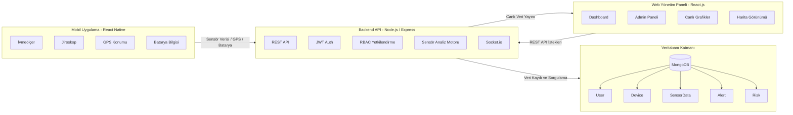
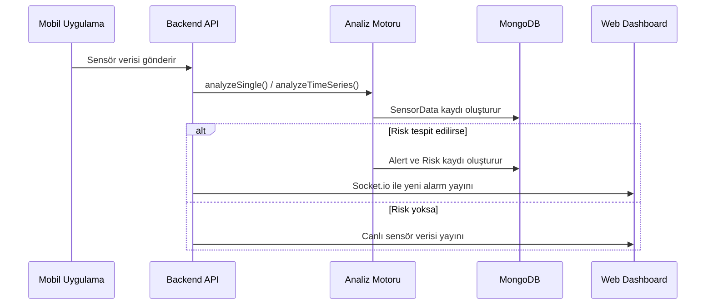

<div align="center">
  

  <h1>VisionGuard Pro</h1>
  <h3>İş Sağlığı ve Güvenliği İzleme Sistemi</h3>

  <p>
    Fabrika ve endüstriyel alanlarda çalışan personelin <b>sensör, konum ve risk verilerini</b>
    gerçek zamanlı izleyen mobil, web ve backend tabanlı güvenlik sistemi.
  </p>

  <p>
    
    
    
    
    
  </p>
</div>

---

## İçindekiler

- [Proje Hakkında](#proje-hakkında)
- [Öne Çıkan Özellikler](#öne-çıkan-özellikler)
- [Ekran Görüntüleri](#ekran-görüntüleri)
- [Sistem Mimarisi](#sistem-mimarisi)
- [Kullanıcı Rolleri](#kullanıcı-rolleri)
- [Teknoloji Yığını](#teknoloji-yığını)
- [Sensör Analiz Motoru](#sensör-analiz-motoru)
- [Veri Modelleri](#veri-modelleri)
- [API Dokümantasyonu](#api-dokümantasyonu)
- [Kurulum ve Çalıştırma](#kurulum-ve-çalıştırma)
- [Proje Klasör Yapısı](#proje-klasör-yapısı)
- [Güvenlik Mimarisi](#güvenlik-mimarisi)
- [Ekip](#ekip)

---

## Proje Hakkında

**VisionGuard Pro**, iş sağlığı ve güvenliği süreçlerini dijitalleştirmek için geliştirilen kapsamlı bir izleme sistemidir. Sistem; **React Native mobil uygulama**, **React.js web yönetim paneli** ve **Node.js/Express backend API** bileşenlerinden oluşur.

Mobil uygulama, çalışanın cihazından **ivmeölçer**, **jiroskop**, **GPS konumu** ve **batarya seviyesi** verilerini toplar. Backend, gelen sensör verilerini analiz ederek **düşme**, **sert darbe**, **hareketsizlik** ve **anomali** gibi risk durumlarını tespit eder. Kritik durumlarda otomatik alarm oluşturulur ve veriler **Socket.io** ile web paneline gerçek zamanlı aktarılır.

---

## Öne Çıkan Özellikler

| Özellik | Açıklama |
|---|---|
| Gerçek zamanlı sensör takibi | Mobil cihazdan ivmeölçer, jiroskop, GPS ve batarya verisi alınır. |
| Otomatik risk analizi | Düşme, darbe, hareketsizlik ve anomali durumları backend tarafında analiz edilir. |
| Canlı dashboard | Socket.io ile sensör ve alarm verileri web paneline anlık yansır. |
| GPS harita entegrasyonu | Web tarafında Leaflet.js, mobil tarafta WebView + Leaflet kullanılır. |
| Rol tabanlı erişim | Admin ve Worker rolleri için farklı yetki seviyeleri uygulanır. |
| Alarm yönetimi | Alarm oluşturma, listeleme, detay görüntüleme ve çözme akışları bulunur. |
| Admin yönetim paneli | Kullanıcı, cihaz ve alarm yönetimi tek ekrandan yapılır. |
| Profil yönetimi | Kullanıcı bilgileri, profil fotoğrafı ve şifre işlemleri desteklenir. |

---

## Ekran Görüntüleri


### Web Paneli

| Giriş Ekranı | Canlı Dashboard | Admin Paneli |
|---|---|---|
|  |  |  |

### Mobil Uygulama

| Giriş | Ana Sayfa | Dashboard | Alarmlar |
|---|---|---|---|
|  |  |  |  |

| Konum / Harita |
|---|
|  |

---

## Sistem Mimarisi

Sistem üç ana uygulama katmanından ve bir veritabanı katmanından oluşur. Web ve mobil istemciler REST API üzerinden backend ile haberleşir; gerçek zamanlı veri aktarımı için Socket.io kullanılır.


flowchart LR
    subgraph Mobile[React Native Mobil Uygulama]
        M1[İvmeölçer]
        M2[Jiroskop]
        M3[GPS]
        M4[Batarya]
        M5[AuthContext + AsyncStorage]
    end

    subgraph Backend[Node.js + Express Backend]
        B1[REST API]
        B2[Sensör Analiz Motoru]
        B3[JWT + RBAC]
        B4[Socket.io]
    end

    subgraph Web[React.js + Vite Web Panel]
        W1[Dashboard]
        W2[Admin Yönetim Paneli]
        W3[Leaflet Harita]
        W4[Recharts Grafikler]
    end

    subgraph DB[(MongoDB)]
        D1[Users]
        D2[Devices]
        D3[SensorData]
        D4[Alerts]
        D5[Risks]
        D6[Reports]
    end

    M1 --> B1
    M2 --> B1
    M3 --> B1
    M4 --> B1
    M5 --> B1
    B1 --> B2
    B2 --> D3
    B2 --> D4
    B2 --> D5
    B1 --> DB
    B4 --> Web
    Web --> B1
```

### Mimari Katmanlar

| Katman | Teknoloji | Sorumluluk |
|---|---|---|
| Mobil Uygulama | React Native + TypeScript | Çalışan sensör verilerini toplama, kişisel alarm ve konum takibi |
| Web Panel | React.js + Vite | Yönetici dashboard'u, grafikler, harita ve yönetim ekranları |
| Backend API | Node.js + Express.js | Kimlik doğrulama, sensör analizi, alarm üretimi, API servisleri |
| Gerçek Zamanlı İletişim | Socket.io | Sensör ve alarm güncellemelerini canlı yayınlama |
| Veritabanı | MongoDB + Mongoose | Kullanıcı, cihaz, sensör, alarm, risk ve rapor kayıtlarını saklama |

---

## Kullanıcı Rolleri

| Rol | Yetki Düzeyi | Erişim Alanları |
|---|---|---|
| **Admin** | Tüm sisteme tam erişim | Yönetim paneli, tüm kullanıcılar, tüm cihazlar, tüm alarmlar, raporlar, alarm çözme |
| **Worker** | Kişisel verilere erişim | Kendi sensör verileri, kendi alarmları, GPS konumu ve profil ekranı |

---

## Teknoloji Yığını

| Kategori | Teknoloji | Kullanım Amacı |
|---|---|---|
| Backend | Node.js, Express.js | RESTful API sunucusu |
| Veritabanı | MongoDB, Mongoose | NoSQL veri saklama ve modelleme |
| Gerçek Zamanlılık | Socket.io | WebSocket tabanlı canlı veri akışı |
| Kimlik Doğrulama | JWT | Token tabanlı güvenli oturum yönetimi |
| Şifre Güvenliği | bcrypt / bcryptjs | Şifre hashleme |
| Web Frontend | React.js, Vite | Yönetim paneli ve dashboard |
| Web Grafik | Recharts | Sensör ve risk grafikleri |
| Web Harita | Leaflet.js | GPS konum görselleştirme |
| Mobil | React Native, TypeScript | Android/iOS personel uygulaması |
| Mobil Navigasyon | React Navigation | Stack ve tab navigasyon yapısı |
| Mobil Sensör | react-native-sensors | İvmeölçer ve jiroskop verisi alma |
| Mobil GPS | react-native-geolocation-service | Konum ve doğruluk bilgisi alma |
| Mobil Harita | WebView + Leaflet.js | Mobil harita görünümü |
| Mobil Depolama | AsyncStorage | Token ve kullanıcı bilgisi saklama |
| Mobil Cihaz Bilgisi | react-native-device-info | Batarya seviyesi alma |

---

## Sensör Analiz Motoru

Backend tarafındaki analiz motoru, mobil uygulamadan gelen sensör verilerini anlık ve zaman serisi bazlı değerlendirir.

### Analiz Kuralları

| Analiz Tipi | Kural / Eşik | Üretilen Risk | Önem Seviyesi |
|---|---:|---|---|
| Düşme şüphesi | `magnitude > 25 m/s²` | Fall | Critical |
| Sert darbe | `magnitude > 20 m/s²` | Impact | High |
| Hareketsizlik | Son 5 kayıtta ivmenin yaklaşık `9.8 m/s²` civarında kalması | Stillness | High |
| Anomali | Son değerin ortalamadan 3 standart sapma uzaklaşması | Anomaly | Medium |

### Sensör Veri Akışı



---

## Veri Modelleri

| Model | Temel Alanlar | Açıklama |
|---|---|---|
| **User** | `name`, `email`, `password`, `role`, `department`, `isActive` | Sistemdeki admin ve worker kullanıcıları |
| **Device** | `deviceId`, `name`, `assignedUser`, `isActive`, `lastSeen` | Kullanıcıya atanmış mobil/izleme cihazı |
| **SensorData** | `userId`, `deviceId`, `accelerometer`, `gyroscope`, `location`, `batteryLevel` | Mobil uygulamadan gelen ham sensör verisi |
| **Alert** | `userId`, `deviceId`, `type`, `severity`, `message`, `location`, `resolved` | Risk durumunda oluşturulan alarm kaydı |
| **Risk** | `userId`, `type`, `level`, `message`, `location` | Analiz sonucunda tespit edilen risk kaydı |
| **Report** | `title`, `details`, `createdBy`, `relatedAlert`, `relatedRisk` | Yönetim ve takip amaçlı rapor kayıtları |

---

## API Dokümantasyonu

Tüm korumalı endpoint'lerde JWT token kullanılmalıdır.

```http
Authorization: Bearer <JWT_TOKEN>
```

### Auth Endpoint'leri

| Method | Endpoint | Açıklama | Yetki |
|---|---|---|---|
| POST | `/api/auth/register` | Yeni kullanıcı kaydı oluşturur | Public |
| POST | `/api/auth/login` | Giriş yapar ve JWT token döndürür | Public |
| GET | `/api/auth/me` | Giriş yapan kullanıcı bilgisini getirir | Auth |
| GET | `/api/auth/users` | Tüm kullanıcıları listeler | Admin |
| PUT | `/api/auth/users/:id/make-admin` | Kullanıcıya admin rolü verir | Admin |
| PUT | `/api/auth/users/:id/make-worker` | Kullanıcıyı worker rolüne çeker | Admin |
| POST | `/api/auth/forgot-password` | Şifre sıfırlama token'ı üretir | Public |
| POST | `/api/auth/reset-password` | Yeni şifre belirler | Public |
| PUT | `/api/auth/change-password` | Mevcut şifreyi değiştirir | Auth |

### Sensör Endpoint'leri

| Method | Endpoint | Açıklama |
|---|---|---|
| POST | `/sensor` | Sensör verisi gönderir, analiz eder ve canlı yayınlar |
| GET | `/sensor/me` | Giriş yapan kullanıcının sensör verilerini getirir |
| GET | `/sensor/recent?limit=20` | Son sensör kayıtlarını getirir |
| GET | `/sensor/analyze` | Son veriler üzerinden zaman serisi analizi yapar |
| GET | `/sensor` | Tüm sensör verilerini listeler |

### Alarm Endpoint'leri

| Method | Endpoint | Açıklama |
|---|---|---|
| POST | `/alert` | Yeni alarm oluşturur |
| GET | `/alert` | Alarmları listeler |
| PUT | `/alert/:id/resolve` | Alarmı çözüldü olarak işaretler |

### Socket.io Olayları

| Olay | Yön | Açıklama |
|---|---|---|
| `connection` | Client → Server | Web veya mobil istemci bağlanır |
| `join` | Client → Server | Kullanıcı kendi odasına katılır |
| `sensorData` | Server → Client | Genel sensör verisi yayını |
| `sensor-update` | Server → Client | Kullanıcıya özel sensör güncellemesi |
| `new-alarm` | Server → Client | Yeni alarm bildirimi |

---

## Kurulum ve Çalıştırma

### Gereksinimler

| Gereksinim | Açıklama |
|---|---|
| Node.js | v16 veya üzeri önerilir |
| MongoDB | Lokal MongoDB veya MongoDB Atlas kullanılabilir |
| Android Studio | Android emülatör veya gerçek cihaz testi için |
| Xcode | iOS geliştirme için, macOS gerektirir |

### 1. Repository'yi Klonlama

```bash
git clone https://github.com/ISG-Risk-Mobil/isg-izleme-sistemi.git
cd isg-izleme-sistemi
```

### 2. Backend Kurulumu

```bash
cd backend
npm install
```

Backend için `.env` dosyası oluşturun:

```env
PORT=5000
MONGO_URI=mongodb://localhost:27017/isg-db
JWT_SECRET=change_this_secret_key
JWT_EXPIRE=1d
```

Backend'i çalıştırın:

```bash
npm run dev
```

### 3. Web Frontend Kurulumu

```bash
cd frontend
npm install
npm run dev
```

Varsayılan web adresi:

```text
http://localhost:3000
```

### 4. Mobil Uygulama Kurulumu

```bash
cd mobil
npm install
```

Mobil için `.env` dosyası oluşturun:

```env
# Android emülatör için
API_URL=http://10.0.2.2:5000/api

# Gerçek Android cihaz için bilgisayarınızın yerel IP adresini kullanın
# API_URL=http://192.168.1.100:5000/api

# iOS simülatör için
# API_URL=http://localhost:5000/api
```

Android çalıştırma:

```bash
npx react-native run-android
```

İOS çalıştırma:

```bash
npx react-native run-ios
```

### 5. İlk Admin Kullanıcısını Oluşturma

Kayıt olan kullanıcılar varsayılan olarak `worker` rolüyle oluşturulur. İlk admin için MongoDB üzerinde bir defaya mahsus aşağıdaki işlem yapılabilir:

```javascript
db.users.updateOne(
  { email: "admin@sirket.com" },
  { $set: { role: "admin" } }
)
```

---

## Proje Klasör Yapısı

```text
isg-izleme-sistemi/
├── backend/
│   ├── server.js
│   ├── analysis.js
│   ├── src/
│   │   ├── routes/
│   │   └── middleware/
│   └── models/
│       ├── User.js
│       ├── Device.js
│       ├── Alert.js
│       ├── Risk.js
│       ├── Report.js
│       └── SensorData.js
│
├── frontend/
│   └── src/
│       ├── App.jsx
│       ├── pages/
│       │   ├── Dashboard.jsx
│       │   ├── LoginPage.jsx
│       │   └── ProfilePage.jsx
│       └── GpsComponents.jsx
│
├── mobil/
│   └── src/
│       ├── context/
│       ├── navigation/
│       ├── screens/
│       │   ├── auth/
│       │   ├── home/
│       │   ├── dashboard/
│       │   ├── alarms/
│       │   ├── devices/
│       │   ├── profile/
│       │   ├── admin/
│       │   └── location/
│       └── services/
│           ├── api/
│           └── sensors/
│
└── docs/
    ├── assets/
    └── screenshots/
```

---

## Güvenlik Mimarisi

| Güvenlik Katmanı | Açıklama |
|---|---|
| JWT Auth | Kullanıcı girişinden sonra token tabanlı kimlik doğrulama yapılır. |
| RBAC | Admin ve Worker rolleri için farklı yetki seviyeleri uygulanır. |
| bcrypt | Şifreler hashlenmiş şekilde saklanır. |
| Protected Routes | Korunan endpoint'lerde `Authorization: Bearer <token>` zorunludur. |
| Admin Middleware | Kullanıcı, cihaz ve alarm yönetimi gibi kritik işlemler admin yetkisine bağlıdır. |
| Token Storage | Web'de localStorage, mobilde AsyncStorage kullanılır. |

---

## Test ve Doğrulama Önerileri

| Test Alanı | Kontrol Edilecek Nokta |
|---|---|
| Kimlik Doğrulama | Kayıt, giriş, token kontrolü, çıkış işlemleri |
| Rol Yetkisi | Worker'ın yalnızca kendi verilerini, adminin tüm verileri görebilmesi |
| Sensör Gönderimi | Mobil cihazdan 10 saniyelik periyotlarla veri gönderilmesi |
| Alarm Üretimi | Düşme, darbe, hareketsizlik ve anomali durumlarında alarm oluşması |
| Gerçek Zamanlılık | Socket.io ile dashboard üzerinde canlı güncelleme alınması |
| Konum | GPS koordinatlarının harita üzerinde doğru gösterilmesi |
| Alarm Çözme | Sadece admin rolünün alarm çözebilmesi |

---

---

## Ekip

| Öğrenci No | Ad Soyad | GitHub Profili |
|---|---|---|
| 23360859076 | Büşra Yesin | [@busrayesinn](https://github.com/busrayesinn) |
| 23360859078 | İsmihan Kırmızıoğlan | [@ismihankrmz](https://github.com/ismihankrmz) |
| 22360859400 | Eda Şen | [@EdaaSen](https://github.com/EdaaSen) |
| 22360859017 | Melike Dal | [@melikedal](https://github.com/melikedal) |

---

## GitHub Deposu

Proje kaynak kodları:

```text
https://github.com/ISG-Risk-Mobil/isg-izleme-sistemi
```

---

## Lisans

Bu proje akademik amaçlı geliştirilmiştir. Kullanım ve dağıtım koşulları proje ekibi tarafından belirlenir.
